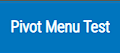

# PivotTable - Visualization Plugin

  

  

## Conteúdo

- [Sobre](#sobre)
- [Configuração](#configuração)
  - [Connection](#connection)
  - [List](#list)
  - [Elements](#elements)
  - [Menu](#menu)
- [Uso](#configuração)

## 💭 Sobre

PivotTable é um plugin baseado na biblioteca [PivotTable.js](https://pivottable.js.org/examples/) onde é possível manusear tabelas de forma mais dinâmica e acessível ao usuário final.

  

## ⚙️ Configuração

Para usar o plugin é necessário criar uma nova `Visualization` e selecionar o plugin `pivottable`:

### Connection

Em Connection, selecione a opção Joomla:

### List

Selecione a Lista ao qual o plugin PivotTable será aplicado:

### Elements

Selecione os elementos da lista selecionar anteriormente que serão mostrados na tabela:

### Menu

Crie um novo menu com o `Menu Item Type` selecionado como `Fabrik -> Visualization`; Em `Select Instace` selecione o nome da label da `Visualization` que foi criada.

Com o menu criado, basta acessar a interface:

## 💻 Uso

Ao abrir o menu criado, aguarde alguns segundos para que a tabela seja gerada:

Agora, podendo ser utilizada da forma desejada:

