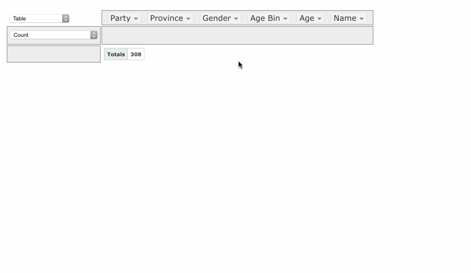
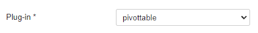
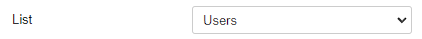
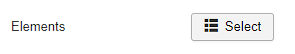
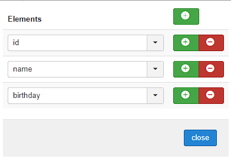
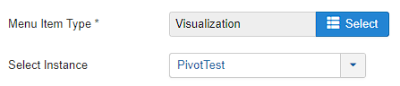
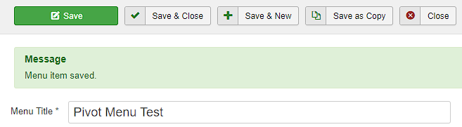
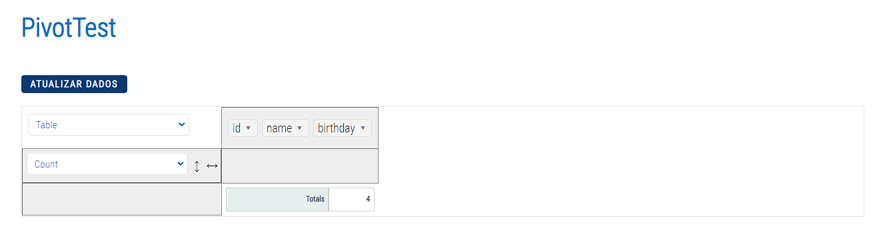
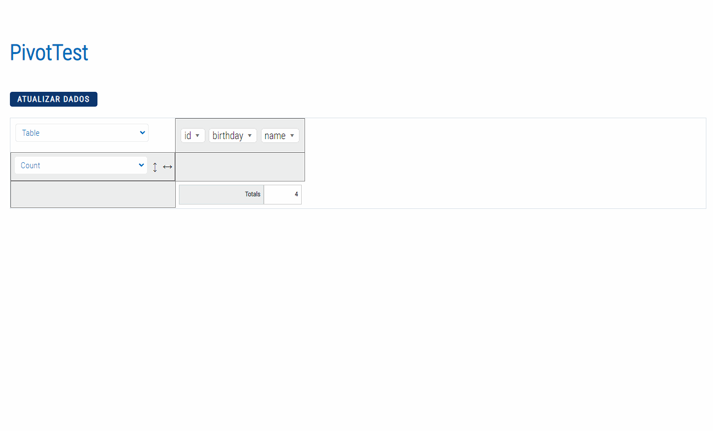

# PivotTable - Visualization Plugin

PivotTable is a plugin based on the [PivotTable.js](https://pivottable.js.org/examples/) library where it is possible to handle tables in a more dynamic and accessible way to the end user.

  

## Content

- [Configuration](#configuration)
  - [Connection](#connection)
  - [List](#list)
  - [Elements](#elements)
  - [Menu](#menu)
- [Usage](#configuration)

### Configuration

To use the plugin it is necessary to create a new `Visualization` and select the `pivottable` plugin:

#### Connection

Under Connection, select the Joomla option:

#### List

Select the List to which the PivotTable plugin will be applied:

#### Elements

Select the elements from the previously selected list that will be shown in the table:

#### Menu

Create a new menu with the `Menu Item Type` selected as `Fabrik -> Visualization`; In `Select Instace` select the label name of the `Visualization` that was created.

With the menu created, just access the interface:

### Usage

When opening the created menu, wait a few seconds for the table to be generated:

Now, it can be used as desired:

